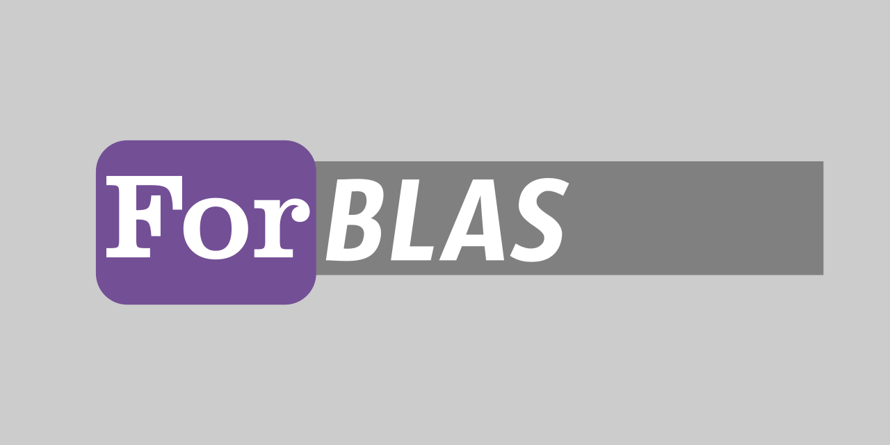

# ForBLAS



## How to Use ForBLAS

### Installation of ForBLAS Library

To use ForBLAS, follow the steps below:

- **Reuirements:**

  Fortran Compiler

- **Clone the repository:**

   You can clone the ForBLAS repository from GitHub using the following command:

   ```shell
   git clone --recurse-submodules https://github.com/gha3mi/forblas.git
   ```

   ```shell
   cd forblas
   ```

- **Build using the Fortran Package Manager (fpm):**

   ForBLAS can be built using [fpm](https://github.com/fortran-lang/fpm).
   Make sure you have fpm installed, and then execute the following command:

  **GNU Fortran Compiler (gfortran)**

   ```shell
   fpm install --prefix . --compiler gfortran --flag "-O3 -frecursive"
   ```

## Running Tests

   ```shell
   fpm test
   ```

   ```shell
 Complex BLAS Test Program Results


 Test of subprogram number  1            CDOTC 
                                    ----- PASS -----

 Test of subprogram number  2            CDOTU 
                                    ----- PASS -----

 Test of subprogram number  3            CAXPY 
                                    ----- PASS -----

 Test of subprogram number  4            CCOPY 
                                    ----- PASS -----

 Test of subprogram number  5            CSWAP 
                                    ----- PASS -----

 Test of subprogram number  6            SCNRM2
                                    ----- PASS -----

 Test of subprogram number  7            SCASUM
                                    ----- PASS -----

 Test of subprogram number  8            CSCAL 
                                    ----- PASS -----

 Test of subprogram number  9            CSSCAL
                                    ----- PASS -----

 Test of subprogram number 10            ICAMAX
                                    ----- PASS -----
 Real BLAS Test Program Results


 Test of subprogram number  1             DDOT 
                                    ----- PASS -----

 Test of subprogram number  2            DAXPY 
                                    ----- PASS -----

 Test of subprogram number  3            DROTG 
                                    ----- PASS -----

 Test of subprogram number  4             DROT 
                                    ----- PASS -----

 Test of subprogram number  5            DCOPY 
                                    ----- PASS -----

 Test of subprogram number  6            DSWAP 
                                    ----- PASS -----

 Test of subprogram number  7            DNRM2 
                                    ----- PASS -----

 Test of subprogram number  8            DASUM 
                                    ----- PASS -----

 Test of subprogram number  9            DSCAL 
                                    ----- PASS -----

 Test of subprogram number 10            IDAMAX
                                    ----- PASS -----

 Test of subprogram number 11            DROTMG
                                    ----- PASS -----

 Test of subprogram number 12            DROTM 
                                    ----- PASS -----

 Test of subprogram number 13            DSDOT 
                                    ----- PASS -----
 Real BLAS Test Program Results


 Test of subprogram number  1             SDOT 
                                    ----- PASS -----

 Test of subprogram number  2            SAXPY 
                                    ----- PASS -----

 Test of subprogram number  3            SROTG 
                                    ----- PASS -----

 Test of subprogram number  4             SROT 
                                    ----- PASS -----

 Test of subprogram number  5            SCOPY 
                                    ----- PASS -----

 Test of subprogram number  6            SSWAP 
                                    ----- PASS -----

 Test of subprogram number  7            SNRM2 
                                    ----- PASS -----

 Test of subprogram number  8            SASUM 
                                    ----- PASS -----

 Test of subprogram number  9            SSCAL 
                                    ----- PASS -----

 Test of subprogram number 10            ISAMAX
                                    ----- PASS -----

 Test of subprogram number 11            SROTMG
                                    ----- PASS -----

 Test of subprogram number 12            SROTM 
                                    ----- PASS -----

 Test of subprogram number 13            SDSDOT
                                    ----- PASS -----
 Complex BLAS Test Program Results


 Test of subprogram number  1            ZDOTC 
                                    ----- PASS -----

 Test of subprogram number  2            ZDOTU 
                                    ----- PASS -----

 Test of subprogram number  3            ZAXPY 
                                    ----- PASS -----

 Test of subprogram number  4            ZCOPY 
                                    ----- PASS -----

 Test of subprogram number  5            ZSWAP 
                                    ----- PASS -----

 Test of subprogram number  6            DZNRM2
                                    ----- PASS -----

 Test of subprogram number  7            DZASUM
                                    ----- PASS -----

 Test of subprogram number  8            ZSCAL 
                                    ----- PASS -----

 Test of subprogram number  9            ZDSCAL
                                    ----- PASS -----

 Test of subprogram number 10            IZAMAX
                                    ----- PASS -----
```

## Contributing

Contributions to `ForBLAS` are welcome!
If you find any issues or would like to suggest improvements,
please open an issue or submit a pull request.
